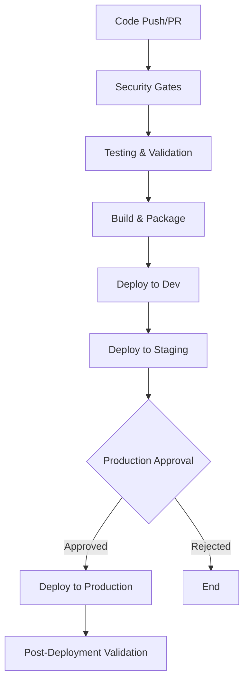

# GameForge CI/CD Pipeline Documentation

## Overview

The GameForge CI/CD pipeline implements a comprehensive DevSecOps approach with security-first principles, automated testing, and progressive deployment strategies. This documentation covers the complete pipeline architecture, configuration, and operational procedures.

## 🏗️ Pipeline Architecture

### Pipeline Stages



### Stage Breakdown

1. **Security Gates** (Parallel Execution)
   - Secret Detection (TruffleHog, Gitleaks)
   - Dependency Scanning (Safety, npm-audit, Trivy)
   - Static Code Analysis (Semgrep, Bandit, SonarQube)
   - Container Security (Trivy, Grype)
   - Compliance Validation

2. **Testing & Validation** (Parallel Execution)
   - Unit Tests (Backend Python, Frontend JavaScript)
   - Integration Tests (API, ML Platform, Monitoring)
   - Performance Tests (Load, Stress, Spike)
   - Security Tests (DAST, API Security)

3. **Build & Package**
   - Multi-architecture container builds (AMD64, ARM64)
   - Software Bill of Materials (SBOM) generation
   - Container image signing with Cosign
   - Artifact publishing to registry

4. **Progressive Deployment**
   - Development (Automatic)
   - Staging (Automatic with validation)
   - Production (Manual approval + Blue/Green)

## 🔒 Security Implementation

### Secret Detection

The pipeline implements multi-layer secret detection:

**Tools Used:**
- **TruffleHog**: High-entropy string detection
- **Gitleaks**: Git history scanning
- **Detect-Secrets**: Baseline secret management

**Scan Scope:**
- Full repository history
- Current commit changes
- Environment variables
- Configuration files

### Dependency Scanning

**Python Dependencies:**
```bash
# Safety - Known vulnerability database
safety check --json --output safety-results.json

# pip-audit - PyPA vulnerability scanner
pip-audit --format=json --output=pip-audit-results.json

# Bandit - Security linter for Python
bandit -r . -f json -o bandit-results.json
```

**Container Dependencies:**
```bash
# Trivy - Comprehensive vulnerability scanner
trivy image --format json --output trivy-results.json

# Grype - Vulnerability scanner for containers
grype dir:. --output json --file grype-results.json
```

### Vulnerability Thresholds

| Severity | Threshold | Action |
|----------|-----------|--------|
| Critical | 0 | Fail pipeline |
| High | 2 | Fail pipeline |
| Medium | 10 | Warning only |
| Low | Unlimited | Info only |

### Checksum Validation

**File Integrity Checks:**
```bash
# Generate checksums for critical files
find . -name "*.py" -o -name "*.js" -o -name "Dockerfile*" | \
  xargs sha256sum > checksums.sha256

# Validate checksums
sha256sum -c checksums.sha256
```

## 🧪 Testing Strategy

### Unit Tests

**Backend Testing (Python):**
```yaml
unit_tests:
  framework: pytest
  coverage_threshold: 80%
  commands:
    - python -m pytest tests/unit/ --cov=gameforge --cov-report=xml
```

### Integration Tests

**Test Categories:**
1. **API Integration**: Test complete API workflows
2. **ML Platform Integration**: Test experiment tracking and model registry
3. **Monitoring Integration**: Test metrics collection and dashboards
4. **Database Integration**: Test data persistence and migrations

## 🚀 Deployment Procedures

### Environment Promotion Workflow

#### 1. Development Environment
- **Trigger**: Every push to `develop` branch
- **Approval**: None required
- **Strategy**: Rolling update
- **Validation**: Health checks + smoke tests

#### 2. Staging Environment  
- **Trigger**: Every push to `main` branch
- **Approval**: None required
- **Strategy**: Rolling update
- **Validation**: Full test suite + performance tests

#### 3. Production Environment
- **Trigger**: Git tags (`v*`) or manual
- **Approval**: Required (2 approvers)
- **Strategy**: Blue/Green deployment
- **Validation**: Comprehensive verification

### Deployment Script Usage

**Basic Deployment:**
```bash
# Deploy to staging
./scripts/automated-deploy.sh -e staging -t v1.2.3

# Production deployment with blue-green
./scripts/automated-deploy.sh -e production -t v1.2.3 -b

# Dry run (preview changes)
./scripts/automated-deploy.sh -e production -t v1.2.3 -d
```

**Rollback Procedures:**
```bash
# Rollback production
./scripts/automated-deploy.sh -e production -r

# Force rollback (skip confirmations)
./scripts/automated-deploy.sh -e production -r -f
```

## 📊 Monitoring & Observability

### Pipeline Metrics

**Key Performance Indicators:**
- **Pipeline Success Rate**: Target >95%
- **Deployment Frequency**: Target >1 per day
- **Lead Time**: Commit to production <4 hours
- **Recovery Time**: Target <30 minutes

**Security Metrics:**
- **Vulnerabilities Detected**: Trend analysis
- **Secret Leaks**: Zero tolerance
- **Compliance Score**: Target >90%
- **Security Scan Duration**: Target <10 minutes

## 🔧 Configuration Management

### Environment Variables

**Required Environment Variables:**
```bash
# Registry Configuration
REGISTRY_URL=ghcr.io
REGISTRY_USERNAME=sandmanmmm
REGISTRY_PASSWORD=${GITHUB_TOKEN}

# Security Tools
SONARQUBE_URL=https://sonar.gameforge.com
SONARQUBE_TOKEN=${SONAR_TOKEN}

# Monitoring
GRAFANA_URL=https://grafana.gameforge.com
GRAFANA_API_KEY=${GRAFANA_TOKEN}
PROMETHEUS_URL=https://prometheus.gameforge.com

# Notifications
SLACK_WEBHOOK_URL=${SLACK_WEBHOOK}
PAGERDUTY_API_KEY=${PAGERDUTY_TOKEN}
```

## 🚨 Troubleshooting Guide

### Common Issues

#### Pipeline Failures

**Issue**: Security scan failures
```bash
# Debug security scan results
cat security-scan-results.json | jq '.vulnerabilities[] | select(.severity == "CRITICAL")'

# Fix: Update dependencies
pip install --upgrade package-name
npm update package-name
```

**Issue**: Test failures
```bash
# Run tests locally with verbose output
python -m pytest tests/ -v --tb=long

# Check test coverage
python -m pytest tests/ --cov=gameforge --cov-report=html
```

## 📚 Best Practices

### Security Best Practices

1. **Principle of Least Privilege**: Minimal permissions for pipeline components
2. **Defense in Depth**: Multiple security layers and checks
3. **Zero Trust**: Verify every component and transaction
4. **Fail Secure**: Default to secure state on failures
5. **Audit Everything**: Comprehensive logging and monitoring

### Development Best Practices

1. **Shift Left**: Early security and quality checks
2. **Fast Feedback**: Quick pipeline execution and results
3. **Incremental Changes**: Small, frequent deployments
4. **Automated Testing**: Comprehensive test coverage
5. **Infrastructure as Code**: Version-controlled configurations

## 📞 Support & Contacts

### Team Contacts

- **DevOps Team**: devops@gameforge.com
- **Security Team**: security@gameforge.com
- **Development Team**: dev@gameforge.com
- **On-Call**: +1-555-GAMEFORGE

---

**Last Updated**: September 13, 2025  
**Version**: 1.0.0  
**Maintained By**: GameForge DevOps Team
